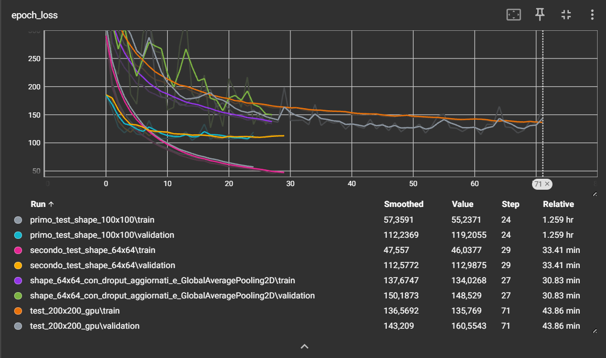
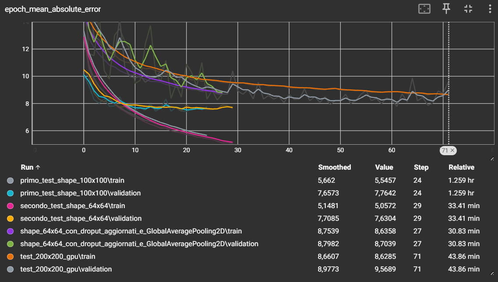
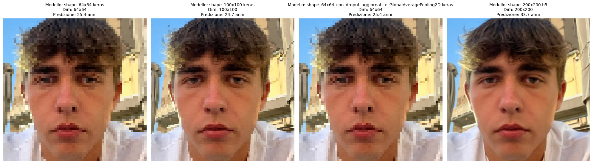

# Stima dell'Età con CNN — UTKFace Dataset

Progetto di Deep Learning per la stima dell'età anagrafica a partire da immagini di volti, realizzato con TensorFlow/Keras e il dataset **UTKFace**.

Vedi anche [DECISION_LOG.md](DECISION_LOG.md) per il percorso decisionale seguito durante la progettazione.

---

## Setup / How to run this project

**Requisiti di sistema:**
- Python 3.11+ (testato con le versioni delle librerie sotto elencate)
- ~2 GB liberi per il dataset UTKFace (scaricato automaticamente al primo avvio)
- GPU consigliata ma non obbligatoria (il training su CPU richiede molto più tempo)

**Installazione delle dipendenze:**

```bash
pip install -r requirements.txt
```

Dipendenze principali (vedi `requirements.txt` per l'elenco completo con versioni):

```
tensorflow==2.21.0
keras==3.14.1
numpy==2.4.4
pandas==3.0.3
matplotlib==3.10.9
pillow==12.2.0
scikit-learn==1.8.0
albumentations==2.0.8
```

**Come avviare il progetto:**

1. Apri `esame_finale_dl.ipynb` ed esegui le celle in ordine: scarica il dataset UTKFace via `kagglehub`, applica la data augmentation, addestra la CNN e salva i modelli in `modelli/`.
2. Per testare un modello già addestrato su una foto personale, crea manualmente una cartella `input/` nella root del progetto e inserisci un'immagine `.jpg`/`.jpeg`. Aggiorna il campo `nome_foto` in `test_rete.ipynb` con il nome del file scelto, poi esegui il notebook.
3. Per monitorare l'andamento del training con TensorBoard:

```bash
tensorboard --logdir keras/logs
```

**Struttura del progetto:**

```
├── esame_finale_dl.ipynb       # Notebook principale: training della CNN
├── test_rete.ipynb             # Notebook di test: confronto tra modelli addestrati
├── requirements.txt            # Dipendenze Python
├── DECISION_LOG.md             # Log delle decisioni progettuali
├── assets/
│   ├── epoch_loss.png          # Screenshot log TensorBoard (loss)
│   ├── mae.png                 # Screenshot log TensorBoard (MAE)
│   └── output.png              # Esempio di output del confronto tra modelli
├── modelli/                    # Modelli addestrati (.keras / .h5)
│   ├── shape_64x64.keras
│   ├── shape_100x100.keras
│   ├── shape_64x64_con_droput_aggiornati_e_GlobalAveragePooling2D.keras
│   └── shape_200x200.h5
├── input/                      # Crea questa cartella e inserisci le immagini da testare (non in repo)
│   └── tua_foto.jpg
├── dataset/                    # Generata automaticamente da kagglehub (non in repo)
│   └── UTKFace/
└── keras/                      # Generata durante il training (non in repo)
    ├── logs/                   # Log TensorBoard
    ├── trainining.log          # Log CSV dell'addestramento
    └── checkpoint-*.keras      # Checkpoint per epoca
```

---

## Spiegazione del progetto

L'obiettivo del progetto è stimare l'età anagrafica di una persona a partire da una singola foto del volto, trattando il problema come una **regressione** (output: un numero reale in anni) anziché come classificazione per fasce d'età.

Il problema che può risolvere è quello della stima automatica dell'età in contesti dove non è disponibile un'anagrafica affidabile: controlli di età (es. accesso a contenuti/prodotti soggetti a limiti anagrafici), analisi demografica di immagini, o come componente in sistemi più ampi di computer vision (es. marketing personalizzato, sicurezza). Si tratta di un progetto didattico che esplora l'intera pipeline di un task di Deep Learning supervisionato su immagini: raccolta/preparazione dati, preprocessing, augmentation, addestramento di una CNN, valutazione e confronto tra più configurazioni architetturali.

---

## Dati

Il dataset utilizzato è **UTKFace**, scaricato automaticamente tramite `kagglehub`:

```python
kagglehub.dataset_download("jangedoo/utkface-new")
```

È stato scelto perché è un dataset pubblico, ampiamente usato in letteratura per la stima di età/genere/etnia da volto, già etichettato senza necessità di annotazione manuale, e di dimensioni gestibili per un progetto didattico con risorse di calcolo limitate.

**Caratteristiche:** oltre 20.000 immagini di volti, con età reale da 0 a 116 anni. Ogni file è una `.jpg` il cui nome codifica direttamente le etichette, nel formato:

```
[età]_[genere]_[etnia]_[timestamp].jpg
```

Le colonne `age` e `gender` vengono estratte dal nome del file per costruire il DataFrame di lavoro (l'etnia, pur presente nel filename, non è stata utilizzata come feature in questo progetto).

**Gestione di dati mancanti o mal formattati:** poiché le etichette derivano direttamente dal nome del file e non da un campo esterno soggetto a errori di digitazione, il rischio di valori mancanti è minimo; eventuali file con nome non conforme al formato atteso vengono scartati in fase di parsing, senza necessità di imputazione.

---

## Ciclo di vita ML

- **Raccolta dati:** automatizzata tramite `kagglehub`, che scarica e mette in cache il dataset UTKFace al primo utilizzo — non richiede gestione manuale dei file.
- **Preprocessing / Augmentation:** le immagini vengono elaborate con **Albumentations**:

  | Trasformazione | Parametro |
  |---|---|
  | Resize | 64×64 px |
  | HorizontalFlip | p=0.5 |
  | RandomBrightnessContrast | p=0.2 |
  | Rotate | limit=15°, p=0.5 |
  | GaussNoise | p=0.1 |
  | Normalize | mean=0.5, std=0.5 |

  Il dataset viene poi suddiviso in **train (80%)** e **test (20%)** con `sklearn.train_test_split` (`random_state=42`, `shuffle=True`).

- **Training:** modello `Sequential` con input `(64, 64, 3)`:

  | Blocco | Layer | Filtri / Neuroni | Note |
  |---|---|---|---|
  | 1 | Conv2D + BN + MaxPool + Dropout | 32 | Estrae bordi e linee |
  | 2 | Conv2D + BN + MaxPool + Dropout | 64 | Rileva forme e curve |
  | 3 | Conv2D + BN + MaxPool + Dropout | 128 | Concetti complessi (rughe, occhiaie) |
  | — | GlobalAveragePooling2D | — | Riduce overfitting |
  | — | Dense + Dropout | 128 | Combinazione feature |
  | — | Dense (output) | 1 | Attivazione `linear` → età |

  Dropout progressivo: 0.2 → 0.2 → 0.3 → 0.5.

  ```python
  optimizer = Adam(learning_rate=1e-3)
  loss      = MeanSquaredError()
  metrics   = [MeanAbsoluteError()]

  epochs     = 100
  batch_size = 32
  ```

  **Callbacks attivi:**
  - `ModelCheckpoint` — salva il miglior checkpoint per epoca
  - `CSVLogger` — log dell'andamento in `keras/trainining.log`
  - `TensorBoard` — log in `keras/logs/<nome_esperimento>/`
  - `EarlyStopping` — patience=10, restore_best_weights=True

- **Validazione:** il 20% di test viene usato per calcolare MAE/MSE finali (vedi sezione Metriche); il notebook `test_rete.ipynb` confronta inoltre le predizioni di tutti i modelli addestrati su una stessa immagine, per una validazione qualitativa oltre che quantitativa.
- **Deploy:** non è previsto un deploy in produzione. I modelli addestrati vengono salvati in `modelli/` (formato `.keras`/`.h5`) e possono essere caricati localmente dal notebook di test per fare inferenza su nuove immagini fornite dall'utente.
- **Monitoring:** vedi sezione MLOps.

---

## MLOps

**Cosa monitorare:** l'andamento di loss (MSE) e MAE su train/validation per ogni run, tramite i log TensorBoard salvati in `keras/logs/`:



**Epoch Loss** — andamento della MSE su train e validation per ogni run.



**Epoch MAE** — confronto tra tutte le run: `secondo_test_shape_64x64` raggiunge la MAE di validation più bassa (~7.6 anni), mentre `test_200x200_gpu` si stabilizza intorno ai 9 anni nonostante più epoche di training.

Questo permette di confrontare configurazioni diverse (risoluzione di input, architettura, dropout) e di individuare overfitting (divergenza tra curva di train e validation). I log di ogni esperimento sono salvati in sottocartelle separate, così da poter confrontare le run direttamente nell'interfaccia con:

```bash
tensorboard --logdir keras/logs
```

**Quando fare re-training:** in un contesto reale, andrebbe rifatto il training quando:
- la MAE su nuovi dati etichettati peggiora rispetto alla baseline misurata in fase di validazione (data/model drift);
- il dataset viene esteso con nuove immagini più rappresentative della popolazione target (es. fasce d'età o condizioni di illuminazione poco coperte da UTKFace);
- cambia sostanzialmente la distribuzione degli input reali rispetto a quella di training (es. foto con inquadrature, illuminazione o dispositivi diversi da quelli tipici del dataset).

In questo progetto didattico non è implementato un monitoring automatico né un trigger di re-training: il confronto tra run è fatto manualmente via TensorBoard.

---

## Rischi, assunzioni e limiti

**Limiti identificati:**
- Il modello è stato addestrato con potenza di calcolo e tempo limitati, su un dataset relativamente piccolo per un task di regressione su volti: le stime prodotte **non sono accurate** e non vanno considerate affidabili.
- Le prestazioni variano molto da foto a foto, in base a illuminazione, angolazione, qualità dell'immagine e caratteristiche del soggetto. Nell'esempio riportato sotto, l'errore rispetto all'età reale va da circa 5 a quasi 14 anni a seconda del modello.
- UTKFace non è necessariamente rappresentativo di tutte le popolazioni ed etnie in egual misura: il modello può avere un bias sistematico su gruppi sotto-rappresentati nel dataset.

**Assunzioni:**
- Si assume che l'età codificata nel nome del file sia corretta e affidabile (nessuna verifica indipendente delle etichette del dataset originale).
- Si assume che un volto centrato e ben illuminato (come da preprocessing con crop quadrato centrato) sia rappresentativo delle condizioni di utilizzo reali.

**Il progetto è funzionante dall'inizio alla fine:** dal download del dataset, al training, fino al confronto tra modelli su una foto fornita dall'utente. Possibili estensioni:
- aumentare la dimensione e la varietà del dataset (più etnie, più fasce d'età, più condizioni di illuminazione);
- sperimentare architetture pre-addestrate (transfer learning, es. MobileNet/ResNet) invece di una CNN addestrata da zero;
- aggiungere una vera pipeline di validazione/monitoring automatizzata invece del confronto manuale via TensorBoard.

---

## Ulteriori informazioni

### Metriche

Il modello ottimizza la **Mean Squared Error (MSE)** come loss e monitora la **Mean Absolute Error (MAE)** come metrica interpretabile (errore medio in anni sull'età predetta).

### Test dei modelli

Il notebook `test_rete.ipynb` permette di confrontare le predizioni di tutti i modelli su una stessa immagine.

**Modelli confrontati:**

| File | Risoluzione |
|---|---|
| `shape_64x64.keras` | 64×64 |
| `shape_100x100.keras` | 100×100 |
| `shape_64x64_con_droput_aggiornati_e_GlobalAveragePooling2D.keras` | 64×64 |
| `shape_200x200.h5` | 200×200 |

Il preprocessing di test usa un **crop quadrato centrato** + resize alla dimensione attesa, seguito da normalizzazione nell'intervallo `[-1, 1]`. L'output è una griglia matplotlib con immagine e predizione in anni per ciascun modello.

### Esempio di output

> **Nota importante:** Le predizioni mostrate di seguito sono puramente indicative e **non costituiscono un risultato attendibile**. Il modello è stato addestrato con potenza di calcolo limitata e su un dataset relativamente scarso per un task di questo tipo, il che non permette di ottenere risultati veramente accurati. Le prestazioni variano significativamente da foto a foto — in base all'illuminazione, angolazione, qualità dell'immagine e caratteristiche del soggetto. A seconda dell'input, il modello potrebbe restituire stime dell'età **anche completamente errate**.

Di seguito un esempio di confronto tra i quattro modelli addestrati su una stessa immagine (soggetto reale: 20 anni):



I modelli a risoluzione 64×64 e 100×100 stimano rispettivamente 25.4, 24.7 e 25.4 anni, mentre il modello `shape_200x200.h5` si discosta maggiormente con una predizione di 33.7 anni. Considerando che il soggetto ha 20 anni, l'errore va da circa 5 fino a quasi 14 anni — un range che conferma come i risultati siano fortemente influenzati dall'immagine di input e non debbano essere considerati affidabili.
